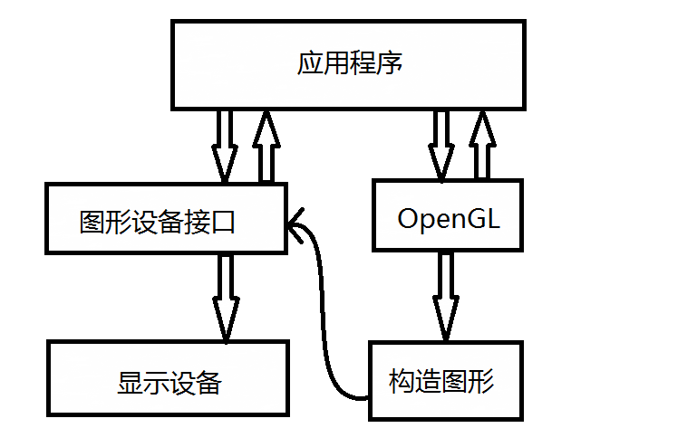
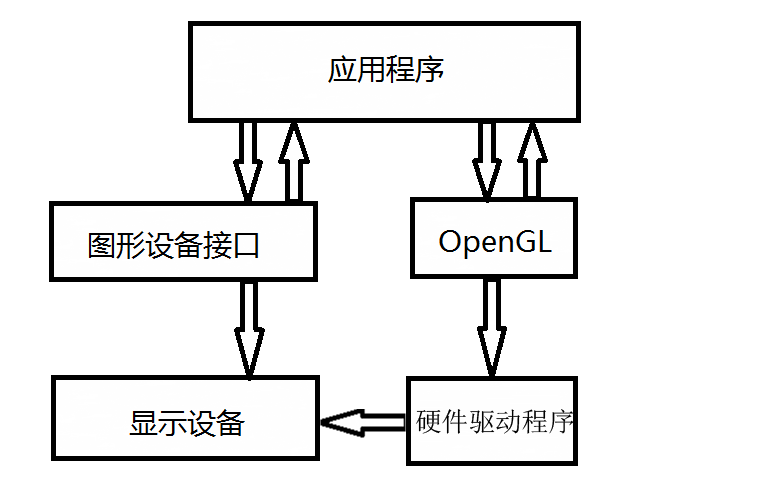
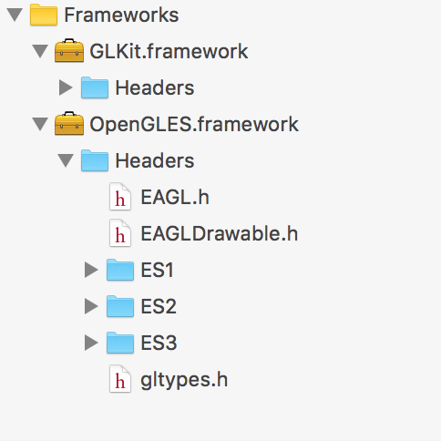
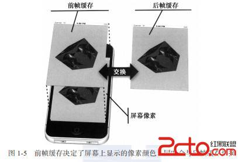

#OpenGLES-理论准备

GitHub地址

<https://github.com/softwarefaith/OpenGLES-Guide/tree/master>

###基础概念

- GPU

图形处理单元，结合几何，颜色，灯光和其他数据产生屏幕硬件组件

[CPU与GPU区别](http://www.zhihu.com/question/19903344)

- 渲染

用3D数据生成一个2D图像的过程

- 像素

一张图片由矩形的颜色点组成，这些颜色点为像素。

图像由像素构成，每个像素有红，蓝，绿 3个元素

###OpenGL ES

#####什么是OpenGL-ES
OpenGL是一套应用程序编程接口(API)，借助这个API我们开发人员就可以开发出对图形硬件具有访问的能力的程序。***OpenGL ES是OpenGL的剪裁版本.***

#####特性

- 过程性

OpenGL不是面向对象的，所以OpenGL无法利用面向对象的特性

- 双重实现

1软件

2硬件

#####与硬件关系

部分运行在CPU，部分运行在GPU上，横跨两个处理器之间，协调两个内存区域的数据交换。

#####OpenGL的组成
- 图元函数：指定要生成图形或图像的图元。主要有两种类型，一种是绘制二维或三维的几何图元，如点，线，多边形等；另一种是离散型的实体，例如：位图。

- 属性函数：属性函数主要是控制图元的外观及样式，例如：对图元的颜色、线型、光照及纹理等效果处理。

- 观察函数：观察函数主要是对摄像机属性的操作。我们可以操作摄像机显示图形或图像近距或是远距效果。

- 控制函数：能够让我们启用或禁用各种OpenGL的特性。

- 查询函数：可以让我们查询OpenGL状态变量的值。

- 输入与窗口控制函数：这个本身不属于OpenGL，但是由于我们会经常在程序中输入输出或是窗口控制操作，所以，这些函数还是比较重要的。

在iOS中需要类库：

#####开发约定

我们以后会见到OpenGL的函数多是以gl开头，因为OpenGL的函数遵循一定的命名约定，它可以告诉我们这个函数来自哪个函数库，并且还可以告诉我们这个函数的参数个数和类型。

　　OpenGL的函数是采用以下的书写格式：

　　<函数库前缀><根命令><可选的参数数量><可选的参数类型>
　　
　　
#####坐标系与变换
在开发OpenGL程序时，需要用到两个坐标系。一个称为对象坐标系，另一个称为世界坐标系。

　　第一个坐标系是我们在开发中使用的坐标系；第二个坐标系又称为窗口坐标系或屏幕坐标系，在这个坐标系中的单位是像素。

　　在绘制的过程中，OpenGL会自动实现从对象到窗口坐标系的转换，所需要的信息是屏幕中显示窗口的尺寸和用户希望显示对象空间的大小。OpenGL中所需要的坐标系变换由两个矩阵决定，即模型视图矩阵和投影矩阵，这些矩阵是OpenGL的状态的一部分。设置这两种矩阵的典型步骤包括以下三个步骤：

　　(1) 指定我们希望修改的矩阵。

　　(2) 将矩阵设为单位矩阵。

　　(3) 修改当前矩阵为用户期望的矩阵。
　　 
　　<code>
　glMatrixMode(GL_PROJECTION);
  glLoadIdentity();
  gluortho2D(-1.0,1.0,-1.0,1.0)
　　</code>
　　
　　
#####状态保存

OpenGL在内部就是一个状态机，函数调用会修改其内部的状态，OpenGL的状态决定了图元的行为和绘制方式。我们对图元的属性和其他状态变量所进行的全部修改。在OpenGL中提供了两种类型的堆栈，可将当前状态保存在堆栈中，以便以后使用。

 

　　矩阵堆栈可用于保存投影矩阵和模型视图矩阵。每种类型的堆栈只能用来容纳相应类型的矩阵。所使用的矩阵由当前矩阵模式(GL_MODELVIEW或GL_PROJECTION)所决定的。可用函数glPushMatrix()和glPopMatrix()使矩阵入栈或出栈。

　　矩阵堆栈的主要作用：一是在构建层次模型时，使用堆栈来遍历这些层次模型的树型数据结构；二是在进行绘制时可以回到先前的视图，而不需要我们重新计算绘制。
　　
#####缓存
图形处理器能够控制和管理的连续RAM.目的是在两个内存区域间数据交换时，更加快速。

OPenGL提供了以下七个步骤:

1.生成Generate:缓存标示符。【glGenBuffers()】

2.绑定(Bind):接下来的运算使用缓存。【glBindBuffers()】

3.缓存数据（Buffer Data):为当前绑定的缓存分配并初始化足够的连续内存。【glBufferData() / glBuferSubData()】

4.启用（Enable）| 禁止（Disable）: 是否使用缓存数据。 【glEnableVertexAttribArray()/glDisableVertexAttribArray()】

5.设置指针(set Pointers): 数据类型以及数据内存偏移值。【glVertexAttribPointer()】

6.绘图（Draw）:使用绑定的缓存数据渲染场景。【glDrawArrays()/glDrawElements()】

7.删除（Delete）:删除以前生成的缓存并释放相关资源.【glDeleteBuffers()】

#####帧缓存（FrameBuffer）

接收渲染结果的缓冲区叫帧缓存。它不需要被初始化，因为他会在适当的时候替换缓存的内容。绑定时，隐式开启。

屏幕显示像素受到保存在前帧缓存的特定缓存中像素颜色元素控制，而程序和操作系统会把渲染结果保存到包括后帧缓存在内的其他帧缓存。

当渲染后的后帧缓存包含一个完成的图像时，前帧缓存与后帧缓存几乎会瞬间切换。后帧缓存会变成新的前帧缓存，同时旧的前帧缓存会变成后帧缓存。

